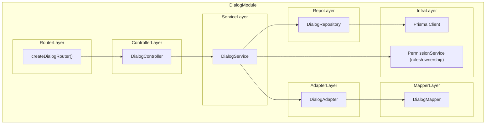
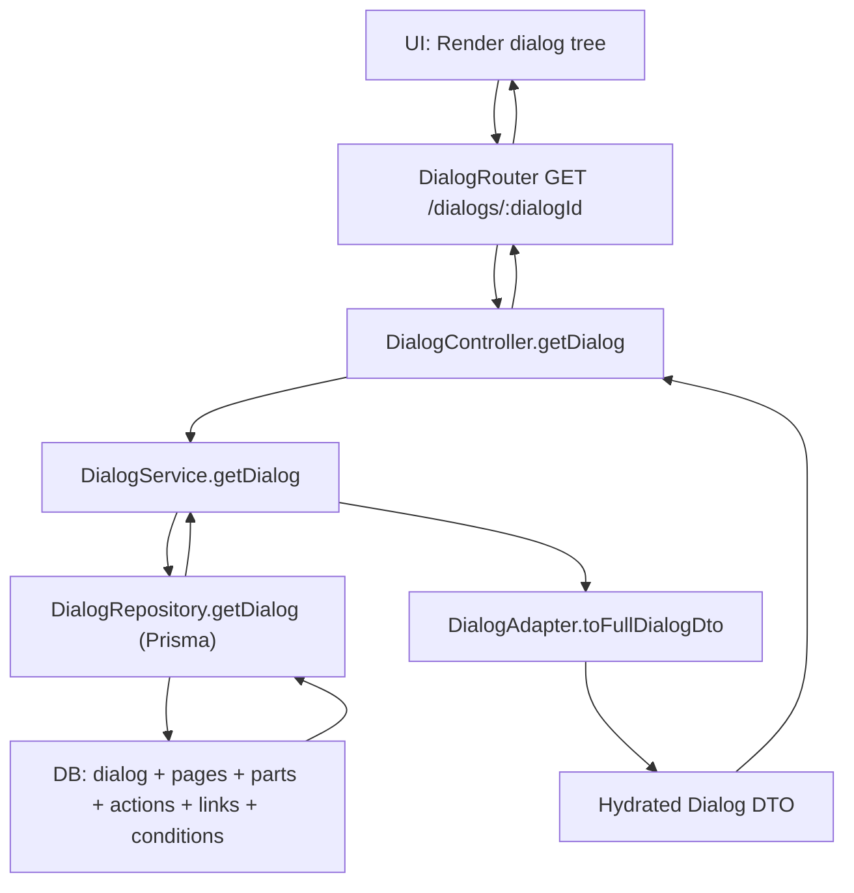
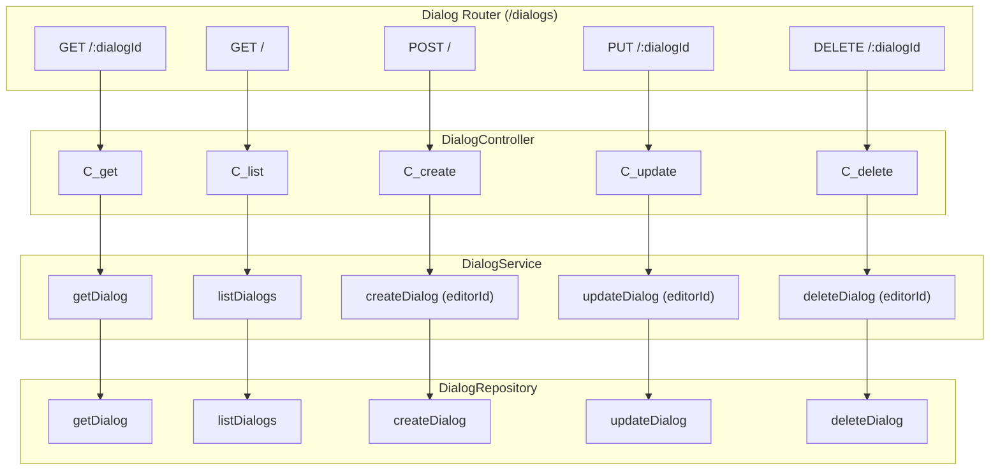

# Dialog Module

The Dialog module provides:

- Dialog definitions (Dialog, Page, Part, Action, Link, Condition)
- Hydration of full dialog graphs
- Quest‑aware execution engine
- Editor‑safe mutation with `editorId` authorization
- Repository, Service, Controller, Router layers

---

## 🧩 Architecture Overview



---

## 🔄 Dialog Hydration Flow



---

## 🛠 Dialog API Routes



---

## ⚔️ Quest‑Aware Execution Flow

```mermaid
flowchart TD

  Start["Start Execution"] --> LoadCtx["Load ExecutionContext"]
  LoadCtx --> LoadPage["Load Page(sequence)"]

  LoadPage --> EvalParts["Evaluate Part Conditions"]
  EvalParts --> VisibleParts["Visible Parts"]

  LoadPage --> EvalActions["Evaluate Action Conditions"]
  EvalActions --> ExecActions["Execute Actions (quest vars, items, movement)"]

  LoadPage --> EvalLinks["Evaluate Link Conditions"]
  EvalLinks --> VisibleLinks["Visible Links"]

  ExecActions --> VisibleLinks
  VisibleParts --> Output["Return { parts, links }"]
  VisibleLinks --> Output```

